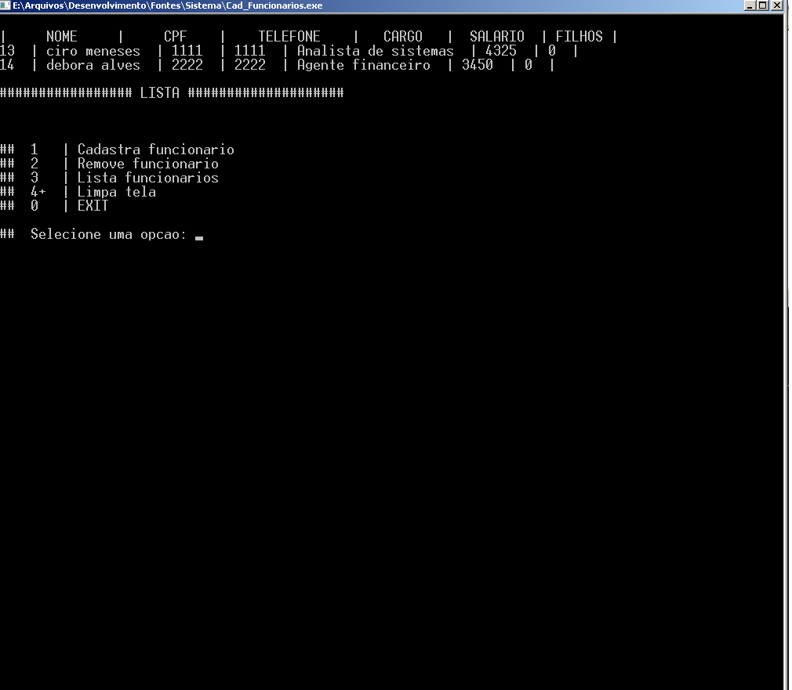

# syscad
Cadastro de funcionários simples feito em C e Mysql

#### Sugestão de tabela do MySQL
create table funcionario(id int primary key auto_increment, nome varchar(100) not null unique, cpf varchar(11) , telefone varchar(11), cargo varchar(40) not null, salario real not null, filhos int);

  
########  INSERIR NA TABELA ##################
insert into funcionario(nome, cpf, telefone, cargo, salario, filhos) values('aa', '1', '21 6546', 'asn asn', '3.254,00', '3');

####### query vulnerável a SQL injection
delete from funcionario where nome = 'string_vinda_do_c';

########  Esse comando causaria um SQL Injection que apagaria todos os registros da tabela funcionario do banco de dados.
delete from funcionario where nome = '' or id > '0';

####   String que causaria o SQL Injection:
' or id > '0

###################   ANOTAÇÕES  #############################

futuramente
||
\/
create table dependente(id int , nome varchar(100) not null unique , cpf varchar(11) not null unique, pai int not null, primary key(id), foreign key(pai) references funcionario(id));

 funcionario(id, nome, cpf, telefone, cargo, salario, filhos )
 
